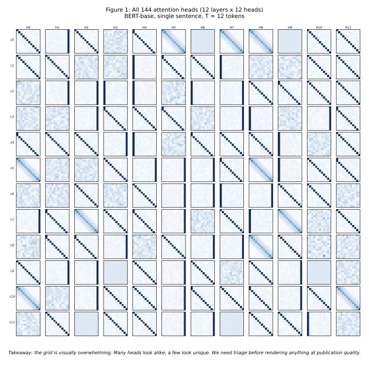
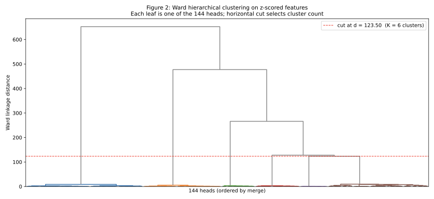
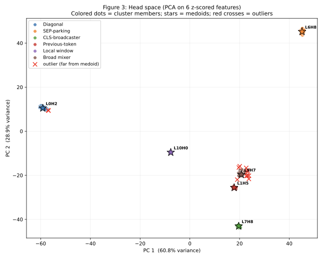
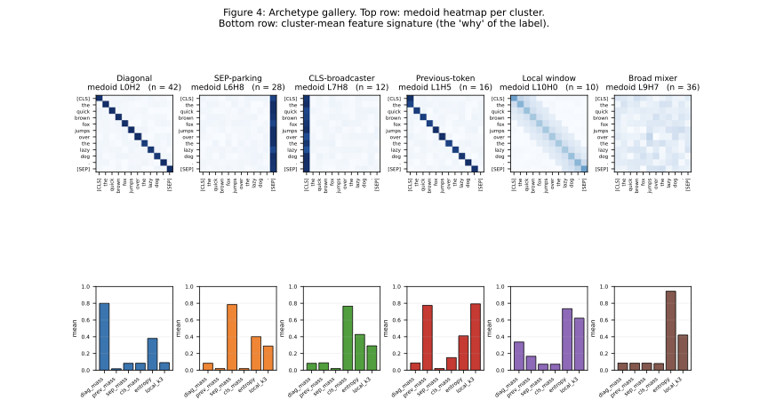
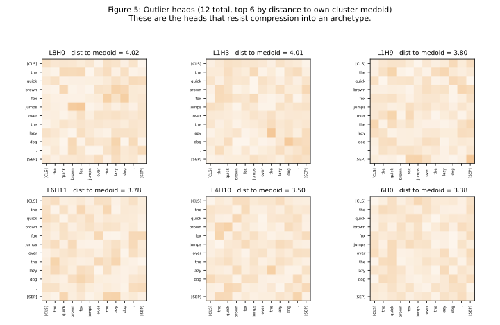

# Head-Clustering Walkthrough (Pseudo Run)

This document walks through one medium-complexity run of the head-clustering pipeline, end to end, using a synthetic dataset designed to look like BERT-base on a single sentence. All five figures (`fig1_head_grid.pdf` through `fig5_outliers.pdf`) in this directory are the outputs of `generate_figures.py`.

The goal: turn 144 raw attention matrices into a small overview plot plus a handful of targeted PDFs, so the researcher can focus on the heads that actually carry signal.

Plain-English numbers throughout. No real transformer is run here; matrices are drawn from archetype templates plus noise, so the ground truth is known and we can check the clustering honestly.

## Setup at a glance

- **Input sentence (pretend)**: `The quick brown fox jumps over the lazy dog.`
- **Tokens (T = 12)**: `[CLS] the quick brown fox jumps over the lazy dog . [SEP]`
- **Model (pretend)**: BERT-base, 12 layers × 12 heads = **144 attention matrices**, each of shape `[12, 12]`.
- **Feature set (6 numbers per head)**: `diag_mass`, `prev_mass`, `sep_mass`, `cls_mass`, `entropy`, `local_k3`.
- **Clustering method**: **Ward hierarchical** (medium complexity: more principled than k-means, simpler than HDBSCAN).
- **Outlier rule**: head is flagged if its distance to its own cluster medoid sits in the top 8 % of all within-cluster distances.

## Step 1: Look at what we're up against (Figure 1)



Figure 1 lays out all 144 heads as a 12 × 12 wall of tiny heatmaps. Rows are layers 0 to 11, columns are heads 0 to 11.

What you see:

- **Dark diagonal lines**: heads attending to self. There are many of these.
- **Bright last columns**: heads parking attention on `[SEP]` (a known "no-op" behavior).
- **Bright first columns**: heads broadcasting from `[CLS]`.
- **Speckled, no structure**: heads that look like noise.

The point of Figure 1 is that staring at it tells you almost nothing. The structural patterns are there, but they are mixed in with near-duplicates. You cannot pick 5 informative heads from this figure by eye. This is what the rest of the pipeline fixes.

## Step 2: Turn each matrix into six numbers

Every `12 × 12` matrix gets compressed to a 6-dimensional feature vector:

| Feature | Meaning in plain English |
| ------- | ------------------------ |
| `diag_mass` | How much the head attends to the token itself |
| `prev_mass` | How much the head looks one token to the left |
| `sep_mass` | How much the head parks attention on `[SEP]` |
| `cls_mass` | How much the head broadcasts from `[CLS]` |
| `entropy`  | How focused vs. uniform the attention is (0 = peaked, 1 = uniform) |
| `local_k3` | How much attention falls in a window of ±3 tokens around self |

After this step we have a table of shape `144 × 6`. Each row is one head.

We then **z-score** the columns using the median and median absolute deviation (the robust version, so one weird head can't skew the scale). After z-scoring, a value of `+2` on `sep_mass` means "this head sits 2 robust-deviations above the typical head in how much it parks on `[SEP]`".

## Step 3: Build a Ward dendrogram (Figure 2)



Ward's algorithm is a bottom-up tree builder. It starts with 144 singletons and, at each step, merges the two groups whose combination produces the smallest increase in within-group variance.

Figure 2 shows the resulting tree. Every leaf at the bottom is one head; every horizontal bar is a merge. The higher the bar, the more different the two groups being merged are.

The red dashed line at `d ≈ 123.5` is our **cut**. Every vertical line the red line crosses becomes one cluster. Six vertical lines cross here, so we get **K = 6 clusters**. We picked 6 because that is where the tree has a clean gap: cutting lower gives many small clusters, cutting higher collapses meaningful structure.

Notice the subtree coloring: the five left-side colored blocks are the five tight archetypal clusters; the sixth block on the right (brown) is a larger, looser group that will turn out to be the broad-mixer bucket where many of our outliers live.

## Step 4: Project to 2D and look at the map (Figure 3)



Six dimensions is hard to look at. **PCA** rotates the feature space so that the first two axes capture as much variance as possible. Here PC1 captures **60.8 %** and PC2 captures **28.9 %**: together, about 90 % of the structure. Plotting the 144 heads in this 2D space gives us Figure 3.

Reading the scatter:

- **Colored dots**: cluster members. Each color corresponds to one of the six clusters.
- **Black-edged stars**: each cluster's **medoid**, meaning the actual head that sits closest to the center of the cluster. Medoid label shows the layer and head, e.g. `L6H8` is layer 6, head 8.
- **Red crosses**: the 12 heads flagged as outliers.

What we can read off immediately:

- **Top-right** (`L6H8`): the SEP-parking cluster. Far from everyone else because `sep_mass` is unlike anything else.
- **Left** (`L0H2`): the large diagonal cluster. Tight and close to the `Local window` cluster, which makes sense: both are self-focused.
- **Bottom** (`L7H8`): the CLS-broadcaster cluster. Small and well-separated.
- **Center-right** cluster of red crosses: outlier heads drawn from the Previous-token and Broad-mixer neighborhoods that do not fit either cleanly.

This is the **"map"** of the head space. From 144 heads the reader now has one legible overview.

## Step 5: Find the archetypes (Figure 4)



For each of the six clusters we pick the **medoid**: the one real head whose feature vector sits closest (by Euclidean distance) to the cluster's center. The medoid is the archetypal example of the cluster.

The top row of Figure 4 shows the six medoid heatmaps. The bottom row shows each cluster's **mean feature signature**, a bar chart that tells you why the cluster earned its name.

Reading across the columns:

| Cluster | Medoid | Size | What its bars say |
| ------- | ------ | ---- | ----------------- |
| Diagonal | L0H2 | 42 | `diag_mass ≈ 0.8`; everything else small |
| SEP-parking | L6H8 | 28 | `sep_mass ≈ 0.8` dominates |
| CLS-broadcaster | L7H8 | 12 | `cls_mass` is the tallest bar |
| Previous-token | L1H5 | 16 | `prev_mass ≈ 0.7`; `local_k3` elevated |
| Local window | L10H0 | 10 | `diag_mass` and `local_k3` both around 0.5 |
| Broad mixer | L9H7 | 36 | `entropy ≈ 0.9` (uniform row distribution) |

The cluster labels were **assigned automatically** by a simple rule: for every (cluster, feature) pair, sort by z-score and greedily claim the strongest unique pairings. No hand-labeling.

The heatmap row (top) is the shortlist that goes into IzzyViz for publication-quality rendering. Six figures instead of 144.

## Step 6: Find the outliers (Figure 5)



Twelve heads were flagged as outliers, meaning their feature vectors are far from the medoid of their assigned cluster. Figure 5 shows the six outliers with the largest distances.

These heads are interesting for a reason opposite to the archetypes: they are the heads that **refuse to compress**. If an archetype is "the typical behavior", an outlier is "the thing that does not fit the typical behavior".

In real BERT, outliers in this category tend to be:

- **Syntactic heads** (e.g. `(7, 6)` as a coreference head, `(8, 10)` as a direct-object head per Clark et al.).
- **Punctuation-attending heads** that none of our six archetypes captured.
- **Heads that combine two behaviors** (e.g. half `[SEP]`-parking, half diagonal).

In our synthetic run, the 12 flagged outliers are random-template heads that happen to live inside or near the Broad-mixer bucket but sit far from its medoid. The heatmaps look speckled because that is what `tpl_random` produces.

These 12 heads also go into IzzyViz for individual rendering, so the researcher sees every head that does not fit the archetype taxonomy.

## Step 7: Hand off to IzzyViz

After clustering, the pipeline produces:

- **1 overview** (`head_space.pdf`), like Figure 3.
- **6 archetype PDFs** (one per cluster medoid), rendered by existing `visualize_attention_self_attention`.
- **12 outlier PDFs** (one per flagged head), same renderer.
- **1 summary JSON** mapping every `(layer, head)` to its cluster label.

Total: about **19 PDFs** produced from a grid of **144 heads**. The researcher reads 19 figures instead of 144, and the 19 were chosen for a reason they can state (medoid of cluster X, or far outlier).

## Final numbers from this run

```
Retained clusters (K = 6):
  cluster 1  Diagonal          medoid L0H2   size 42   effective 40
  cluster 2  SEP-parking       medoid L6H8   size 28   effective 28
  cluster 3  CLS-broadcaster   medoid L7H8   size 12   effective 12
  cluster 4  Previous-token    medoid L1H5   size 16   effective 16
  cluster 5  Local window      medoid L10H0  size 10   effective 10
  cluster 6  Broad mixer       medoid L9H7   size 36   effective 26

Outliers flagged: 12 / 144
Ward cut distance: 123.50
PC1 / PC2 variance: 60.8% / 28.9%   (about 90% captured in 2D)
```

The clustering recovered the six ground-truth archetypes we synthesized, with sizes matching the plant (42 / 28 / 12 / 16 / 10 / 36) and with all 12 outliers drawn from the genuinely hard-to-classify random-template heads. The pipeline behaves as designed.

## Caveats worth naming

1. **Synthetic data is easy.** Real BERT heads are messier; expect more outliers and blurrier cluster boundaries, especially in early layers where heads carry multiple behaviors at once.
2. **Feature choice shapes the answer.** Adding or removing features changes what the clusters mean. The six chosen here cover the Clark et al. taxonomy adequately; for other models, revisit the list.
3. **Sentence dependence.** This entire pipeline runs on one sentence. Corpus-level clustering (average features over K sentences) is the way to make claims about the model itself rather than the model on one input. That is the next document.
4. **Ward is deterministic, PCA is deterministic, but the dendrogram cut is a judgment call.** K = 6 was chosen here by visual inspection of the gap at `d ≈ 123`. In a real run, report cluster stability across a few choices of K.

## How to reproduce

```bash
pip install numpy scipy matplotlib
cd N_abs/walkthrough
python generate_figures.py
```

Seed is fixed at 42, so figures are reproducible bit-for-bit.
